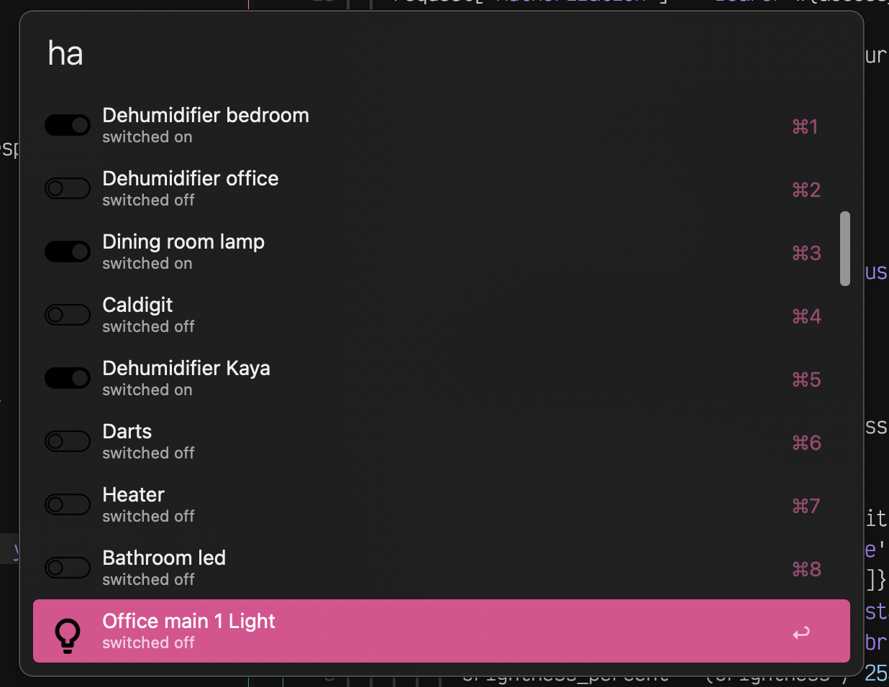

# Home Assistant Lights and Switches for Alfred

This Alfred workflow allows you to interact with your Home Assistant instance directly from Alfred. You can quickly toggle lights, switches, and other entities, as well as adjust brightness levels for lights.

## Why?

There is an [existing workflow](https://github.com/Skakiz/Alfred-Home-assistant-workflow) created by @Skakiz. It was [forked](https://github.com/s00500/Alfred-Home-assistant-workflow/tree/2.0.0) to support long-lived access tokens, which are now required. However, it uses Python 2 and would need changes to work in modern environments using Python 3. 

I'm not great with Python. In addition, all that I require is a simple and quick way to toggle lights and switches. Therefore, I decided to write a quick replacement in Ruby.

## Features

- **List Entities**: Quickly list and filter entities from your Home Assistant instance.
- **Toggle Entities**: Toggle lights and switches on or off directly from Alfred.
- **Adjust Brightness**: Adjust brightness levels for lights by specifying a brightness value.

## Installation

1. Download the workflow file from the [releases page](https://github.com/vincentezw/alfred-homeassistant/releases/).
2. Double-click the downloaded file to import it into Alfred.
3. Configure the workflow by clicking the "configure" keyword and entering your Home Assistant instance URL and access token.

## Usage

### List Entities

- Type `ha` in Alfred to list all entities from your Home Assistant instance.
- Use keyword arguments to filter entities by name. For example, `ha living` will filter entities with "living" in their name.

### Toggle Entities

- To toggle an entity (e.g., light or switch), select it from the list and press Enter.

### Adjust Brightness

- To adjust the brightness of a light, select it from the list and append `%brightness_value` to the entity ID. For example, `light.living_room %50` will set the brightness of the "Living Room" light to 50%.

### Excluding Entities

- You can exclude entities from the list by configuring exclusions in the workflow settings. Wildcards (*) can be used for pattern matching.

## Configuration

1. Click the "configure" keyword in Alfred to open the workflow settings.
2. Enter your Home Assistant instance URL and access token.
3. Configure excluded entities by entering entity IDs or patterns using wildcards.

## Feedback

If you encounter any issues or have suggestions for improvement, please [open an issue](https://github.com/vincentezw/alfred-homeassistant/issues) on GitHub. PRs are also welcome.

